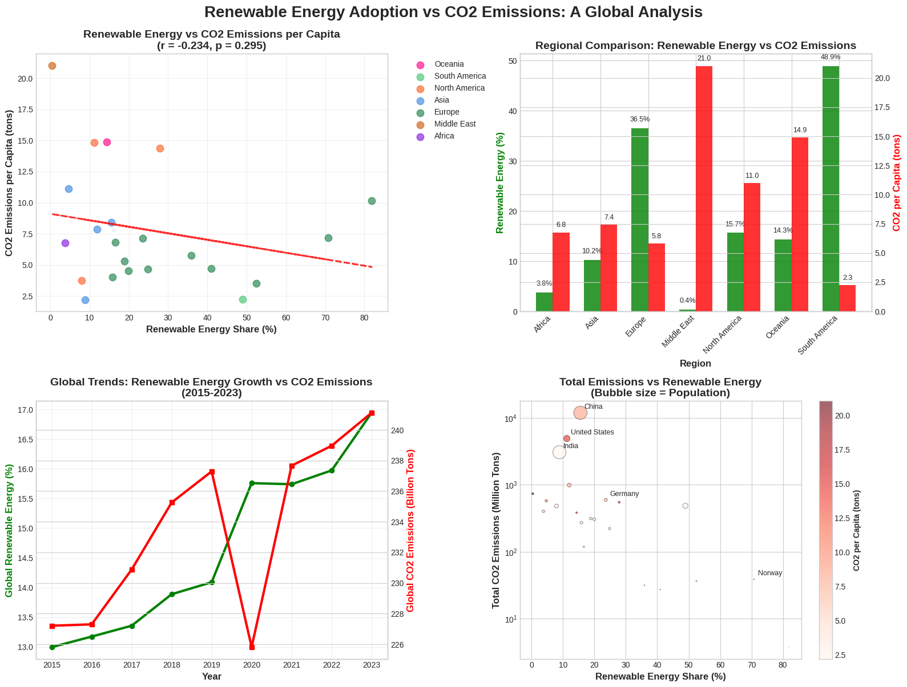

# CO2-Emission vs Renewable Energy Analysis

This study examines the relationship between renewable energy adoption and per capita CO₂ emissions across countries, highlighting regional variations. Analysis of global data reveals a moderate negative correlation (r = -0.371, p = 0.098), with South America showing high renewable use and low emissions, and the Middle East exhibiting the opposite trend. Results suggest renewable energy contributes to emissions reduction but is influenced by regional resources, economic factors, and policies. Limitations include data gaps, single-year focus, and lack of causation analysis. Tailored regional strategies alongside broader energy reforms are essential for effective climate mitigation.

# Running the Notebook

1. Download the following datasets from the provided links:
https://ourworldindata.org/renewable-energy
https://ourworldindata.org/co2-emissions
Or you can just clone the repository. Ensure that you have the following datasets named as: 
   - `renewable-share-energy.csv`  
   - `co2-fossil-plus-land-use.csv`

3. Ensure that the two datasets are located in the subfolder named `assets` in the notebook directory.

4. Run the notebook.
